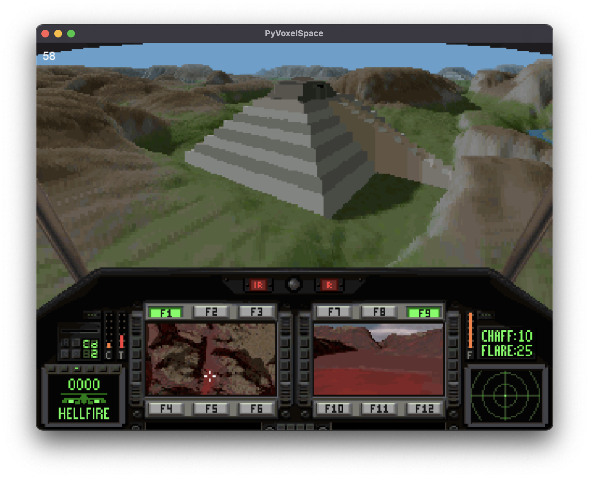

[](https://github.com/booncol/pyvoxelspace/blob/main/LICENSE)

**PyVoxelSpace** is a simple Python implementation of the Voxel Space rendering technique, originally invented by Kyle Freeman and used in the 1992 game "Comanche: Maximum Overkill".
This project utilizes Python 3.11, PyGame for drawing, and the Numba JIT (Just-In-Time) compiler to speed up per-pixel calculations.



## Table of Contents

- [Features](#features)
- [Installation](#installation)
- [Usage](#usage)
- [Controls](#controls)
- [Contributing](#contributing)
- [License](#license)

## Features

- Recreates the Voxel Space rendering technique in Python.
- Utilizes PyGame for rendering the game.
- Speeds up per-pixel calculations using Numba JIT.
- Simple and nostalgic gameplay inspired by early 3D games.

## Installation

To get started with the game, follow these installation steps:

1. Clone this repository to your local machine:

   ```bash
   git clone https://github.com/booncol/pyvoxelspace.git
   cd pyvoxelspace
   ```
2. Install the project dependencies:

   ```bash
   pip install -r requirements.txt
   ```

3. Run the game:

   ```bash
   python main.py
   ```
   
## Usage

Run the game using the instructions in the installation section. The game allows you to explore the Voxel Space rendering technique in a nostalgic gaming environment.

## Controls

Use the following controls to navigate the game:

- `W` - Move forward
- `S` - Move backward
- `A` - Turn left
- `D` - Turn right
- `Space` - Move the horizon down (adjust vertical angle)
- `Right Shift` - Move the horizon up (adjust vertical angle)
- `Arrow Up` - Move the camera up (adjust height)
- `Arrow Down` - Move the camera down (adjust height)

## License

This project is licensed under the MIT License - see the [LICENSE](https://github.com/booncol/pyvoxelspace/blob/main/LICENSE) file for details.

## Contributing
Please read [CONTRIBUTING.md](https://github.com/booncol/pyvoxelspace/blob/main/CONTRIBUTING.md) for details on my code of conduct, and the process for submitting pull requests to me.

## Contact
If you have questions or need assistance, feel free to contact me.
